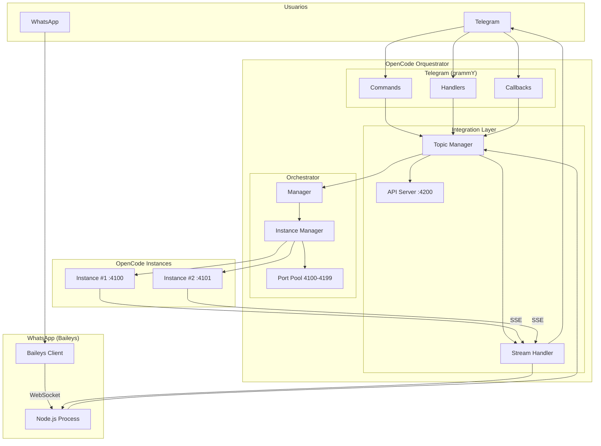
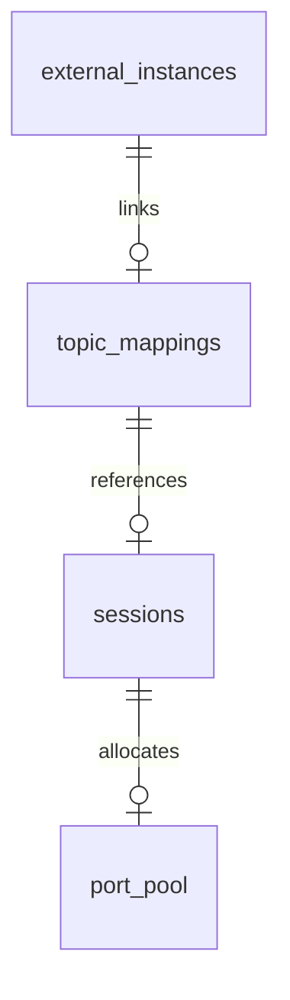

# OpenCode Orquestrator - Documentación de Diseño (v0.8.0)

## Tabla de Contenidos

1. [Arquitectura](#1-arquitectura)
2. [Flujo de Mensajes](#2-flujo-de-mensajes)
3. [WhatsApp Integration](#3-whatsapp-integration)
4. [API Reference](#4-api-reference)
5. [Database Schema](#5-database-schema)
6. [ADRs](#6-adrs)
7. [Non-Functional Requirements](#7-non-functional-requirements)
8. [Testing](#8-testing)

---

## 1. Arquitectura

### Diagrama de Alto Nivel



### Componentes Principales

| Componente | Descripción | Archivo |
|------------|-------------|---------|
| **grammY Bot** | Bot de Telegram | `src/index.ts` |
| **Topic Manager** | Gestiona topics/sessions | `src/forum/topic-manager.ts` |
| **Stream Handler** | Maneja streaming SSE | `src/opencode/stream-handler.ts` |
| **API Server** | Endpoints REST | `src/api-server.ts` |
| **Orchestrator** | Gestiona instancias OpenCode | `src/orchestrator/` |
| **WhatsApp Handler** | Integración WhatsApp | `src/whatsapp/` |

---

## 2. Flujo de Mensajes

### Flujo Telegram

```
Usuario → Bot → validateUser → routeMessage → OpenCode
                                                        ↓
                                                    SSE Events
                                                        ↓
                                                   StreamHandler
                                                        ↓
                                                    Telegram (edit message)
```

### Flujo WhatsApp

```
Usuario → WhatsApp → Baileys → HTTP POST /api/whatsapp/send
                                                       ↓
                                                  OpenCode
                                                       ↓
                                                   SSE Events
                                                       ↓
                                                  HTTP POST response
                                                       ↓
                                                  WhatsApp (edit message)
```

---

## 3. WhatsApp Integration

### Arquitectura

```
┌─────────────────────────────────────────────────────────────┐
│                    WhatsApp Integration                      │
├─────────────────────────────────────────────────────────────┤
│                                                               │
│  WhatsApp    ┌───────────┐    ┌─────────────────┐          │
│  User        │  Baileys  │───►│  Node.js       │          │
│  Message     │  (WS)     │    │  Process       │          │
│               └───────────┘    └────────┬────────┘          │
│                                         │                    │
│                                         │ HTTP               │
│                                         ▼                    │
│                               ┌─────────────────┐           │
│                               │  API Server     │           │
│                               │  /api/whatsapp  │           │
│                               └────────┬────────┘           │
│                                         │                    │
│                                         │                    │
│                               ┌─────────┴────────┐          │
│                               │  Integration     │          │
│                               │  Layer           │          │
│                               └─────────┬────────┘          │
│                                         │                    │
│                                         ▼                    │
│                               ┌─────────────────┐           │
│                               │  OpenCode       │           │
│                               │  Instance       │           │
│                               └─────────────────┘           │
└─────────────────────────────────────────────────────────────┘
```

### Por qué Node.js separado

Bun no soporta WebSocket nativo → Baileys requiere WebSocket → Ejecutamos en proceso Node.js separado.

---

## 4. API Reference

Ver documento completo: [docs/openapi.yaml](docs/openapi.yaml)

### Endpoints Principales

| Method | Endpoint | Descripción |
|--------|----------|-------------|
| GET | `/api/health` | Health check |
| GET | `/metrics` | Prometheus metrics |
| POST | `/api/whatsapp/send` | Enviar mensaje WhatsApp |
| GET | `/api/whatsapp/group?jid=` | Info de grupo |
| POST | `/api/register` | Registrar instancia |
| POST | `/api/unregister` | Desregistrar instancia |
| GET | `/api/status/{sessionId}` | Estado de sesión |
| GET | `/api/instances` | Listar instancias |

### Autenticación

Header `X-API-Key` con API key configurada en `.env`.

---

## 5. Database Schema

Ver documento completo: [docs/database-schema.md](docs/database-schema.md)

### Esquema Simplificado

```sql
-- Topic → Session mappings
CREATE TABLE topic_mappings (
  topic_id INTEGER PRIMARY KEY,
  session_id TEXT NOT NULL,
  work_dir TEXT,
  status TEXT DEFAULT 'active',
  chat_id INTEGER NOT NULL
);

-- External instances (OpenCode plugin)
CREATE TABLE external_instances (
  session_id TEXT PRIMARY KEY,
  work_dir TEXT NOT NULL,
  topic_id INTEGER NOT NULL,
  opencode_port INTEGER NOT NULL
);

-- Port allocation pool
CREATE TABLE port_pool (
  port INTEGER PRIMARY KEY,
  session_id TEXT
);
```

### Diagrama de Relaciones



---

## 6. ADRs

### ADR-001: Runtime Shim (Bun/Node)

**Status:** Aceptado

Permite ejecutar en Bun o Node.js con misma API.

### ADR-002: WhatsApp via Fork Process

**Status:** Aceptado

WhatsApp corre en proceso Node.js separado por limitación de WebSocket en Bun.

### ADR-003: SSE para Streaming

**Status:** Aceptado

OpenCode usa SSE → parsear eventos → editar mensajes en Telegram.

### ADR-004: Path Traversal Prevention

**Status:** Aceptado

Validación: decode → null bytes → `..` → paths sensibles → base path.

### ADR-005: SQLite WAL Mode

**Status:** Aceptado

Persistencia simple con transacciones ACID y modo WAL.

---

## 7. Non-Functional Requirements

### Performance

| Métrica | Objetivo | Estado |
|---------|----------|--------|
| Latencia mensaje | < 2s | ✅ 1-3s |
| Memoria | < 512MB | ✅ 100-200MB |
| Sesiones concurrentes | 20 máx | ✅ Configurable |
| Respuesta API | < 100ms | ✅ < 50ms |

### Security

| Requisito | Implementación |
|-----------|----------------|
| Path traversal | Validación + paths bloqueados |
| Secrets | Solo variables de entorno |
| API auth | Comparación HMAC de API key |
| Rate limiting | Algoritmo token bucket |

### Reliability

| Requisito | Implementación |
|-----------|----------------|
| Crash recovery | Auto-restart instancias |
| Persistencia | SQLite WAL mode |
| Health checks | Probe periódico de puertos |

---

## 8. Testing

| Métrica | Valor |
|---------|-------|
| Framework | Vitest |
| Tests | 139 passing |
| Coverage | 53% funciones, 59% líneas |

### Comandos

```bash
bun test              # Ejecutar tests
bun test --coverage   # Con coverage
```

### Áreas con bajo coverage

- `api-server.ts` (24% funciones)
- `opencode/client.ts` (0% funciones)

---

## Future Considerations

| Mejora | Prioridad |
|--------|----------|
| Redis para estado compartido | Media |
| Message queue para alta carga | Baja |
| OpenTelemetry tracing | Baja |
| Plugin system para canales | Baja |

---

*Documento actualizado - v0.8.0*