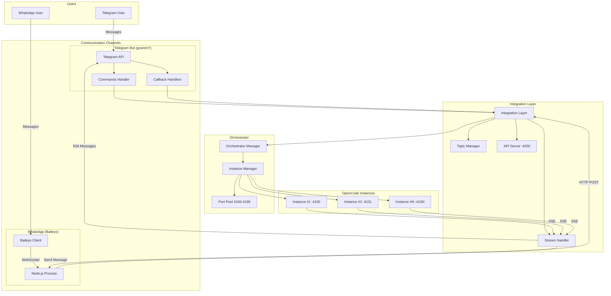
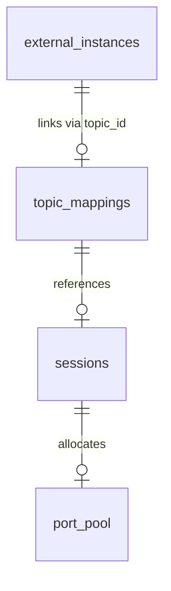

# OpenCode Orquestrator - Documentación de Diseño (v0.8.0)

## Tabla de Contenidos

1. [Arquitectura General](#1-arquitectura-general-con-whatsapp)
2. [Canales de Comunicación](#2-canales-de-comunicación)
3. [Flujo de Mensajes](#3-flujo-de-mensajes-actualizado)
4. [ADRs](#appendix-adrs-architecture-decision-records)
5. [Mermaid Diagram](#appendix-mermaid-diagram)
6. [Non-Functional Requirements](#appendix-non-functional-requirements)
7. [Future Considerations](#appendix-future-considerations)
8. [API Reference](#appendix-openapi-specification)
9. [Database Schema](#appendix-database-schema)

## 1. Arquitectura General (con WhatsApp)

```
┌──────────────────────────────────────────────────────────────────────────┐
│                           USUARIO                                        │
│  Telegram App ──► Supergroup with Forum Topics              │
│  WhatsApp App  ──► Group Chat                       │
│        │                                                 │
│        ▼                                                 │
│  ┌────────────────────────────────────────────────────────┐              │
│  │           Telegram API (grammY Bot)                    │              │
│  │  ┌──────────┐  ┌──────────┐  ┌──────────────┐      │              │
│  │  │Commands  │  │ Handlers │  │Callbacks     │      │              │
│  │  └──────────┘  └──────────┘  └──────────────┘      │              │
│  └────────────────────────────────────────────────────────┘              │
│                          │                                               │
│                          ▼                                               │
│  ┌────────────────────────────────────────────────────────┐              │
│  │         Integration Layer (integration.ts)             │              │
│  │  ┌─────────────┐  ┌──────────────┐  ┌────────────┐   │              │
│  │  │TopicManager │  │StreamHandler │  │API Server  │   │              │
│  │  └─────────────┘  └──────────────┘  └────────────┘   │              │
│  │                          │                              │              │
│  │  ┌───────────────────────┴───────────────────────┐   │              │
│  │  │     WhatsApp Handler (Baileys via HTTP)         │   │              │
│  │  │  - sendMessage (via conn.sendMessage)           │   │              │
│  │  │  - editMessage (via edit key)                │   │              │
│  │  │  - Session mapping (session → WhatsApp JID)  │   │              │
│  │  └───────────────────────────────────────────┘   │              │
│  └────────────────────────────────────────────────────────┘              │
│                          │                                               │
│          ┌───────────────┼───────────────┐                             │
│          ▼               ▼               ▼                            │
│  ���─────────────────┐ ┌─────────────────┐ ┌─────────────────┐    │
│  │  Orchestrator    │ │ ExternalPort   │ │ Discovered      │  │
│  │  (Managed)       │ │ (External)     │ │ (TUI Sessions) │  │
│  │  ┌───────────┐   │ │  ┌───────────┐ │ │  ┌───────────┐  │  │
│  │  │Instance#1 │   │ │  │Instance#1 │ │ │  │Instance#1 │  │  │
│  │  │Port:4100  │   │ │  │Port:4096  │ │ │  │Port:?    │  │  │
│  │  │opencode   │   │ │  │opencode   │ │ │  │opencode   │  │  │
│  │  │serve      │   │ │  │serve      │ │ │  │tui       │  │  │
│  │  └───────────┘   │ │  └───────────┘ │ │  └───────────┘  │  │
│  │  ┌───────────┐   │ │                │ │                 │  │           │
│  │  │Instance#2 │   │ │                │ │                 │  │
│  │  │Port:4101  │   │ └────────────────┘ └─────────────────┘  │
│  │  └───────────┘                                             │
│  └────────────────────────────────────────────────────────────┘            │
└────────────────────────────────────────────────────────────────────────────┘
```

## 2. Canales de Comunicación

```
┌─────────────────────┐     ┌─────────────────────┐
│    TELEGRAM         │     │     WHATSAPP         │
│                     │     │                     │
│  Supergroup +       │     │  Group Chat         │
│  Forum Topics       │     │  (via Baileys)      │
│         │           │     │         │           │
│         ▼           │     │         ▼           │
│  ┌─────────────┐    │     │  ┌─────────────┐    │
│  │ Mensaje     │    │     │  │ Mensaje     │    │
│  │ al Bot     │    │     │  │ al Bot     │    │
│  └──────┬──────┘    │     │  └──────┬──────┘    │
│         │           │     │         │           │
│         ▼           │     │         ▼           │
│  ┌─────────────┐    │     │  ┌─────────────┐    │
│  │ Response    │    │     │  │ Edit        │    │
│  │ en Topic    │    │     │  │ Mensaje     │    │
│  └─────────────┘    │     │  └─────────────┘    │
└─────────────────────┘     └─────────────────────┘
```

## 3. Flujo de Mensajes (Actualizado)

```
┌─────────────────────────────────────────────────────────────────────────┐
│                    MENSAJE FLUX                                         │
└─────────────────────────────────────────────���───────────────────────────┘

Usuario envia mensaje (Telegram o WhatsApp)
         │
         ▼
┌───────────────────┐     ┌───────────────┐
│ validateChannel  │ ──► │Telegram/WhatsApp │
│                   │     │   NO            │ ──► IGNORE
└────────┬──────────┘     └───────┬───────┘
         │                        │
         ▼                        ▼
┌───────────────────┐  ┌──────────────────┐
│ Route to Instance │  │ Same OpenCode    │
│ (topicId calc)   │  │ Session (shared)  │
└────────┬──────────┘  └────────┬─────────┘
         │                      │
         ▼                      ▼
┌───────────────────┐  ┌──────────────────┐
│ Send to OpenCode ──►│─►│ Process &        │
│                    │  │ Stream Response  │
└────────┬──────────┘  └────────┬─────────┘
         │                      │
         ▼                      ▼
┌───────────────────┐  ┌──────────────────┐
│ Send Response    │  │ Edit (WhatsApp) │
│ to Original     │  │ Reply (Telegram)│
│ Channel         │  │ (same channel)   │
└───────────────────┘  └──────────────────┘
```

## 4. WhatsApp - Detalles de Implementación

```
WhatsApp Message Flow:
────────────────────

1. Mensaje llega a WhatsApp Handler (message.ts)
         │
         ▼
2. forwardToOrchestrator() → HTTP POST /api/whatsapp/send
   - Incluye messageKey para edición posterior
         │
         ▼
3. API Server → handleWhatsAppSend()
   - Guarda messageKey en pendingWhatsAppMessages Map
         │
         ▼
4. topicManager.routeMessage() → OpenCode Instance
         │
         ▼
5. StreamHandler captura texto vía setOnTextResponse()
   - Guarda en sessionResponses Map
         │
         ▼
6. session.idle → setOnSessionIdle callback
   - Recupera messageKey y response
   - Envía edit con conn.sendMessage(..., { edit: messageKey })
```
┌───────────────────┐
│ grammY Bot        │
│ (middleware)      │
└────────┬──────────┘
         │
         ▼
┌───────────────────┐     ┌───────────────┐
│ validateUser      │ ──► │Allowed? NO    │ ──► IGNORE
│ (chatId, userId)  │     │Allowed? SI    │
└────────┬──────────┘     └───────┬───────┘
         │                        │
         ▼                        ▼
┌───────────────────┐  ┌──────────────────┐
│ isCommand?        │  │ROUTE MESSAGE     │
│ /status /help etc │  │ to Instance      │
└────────┬──────────┘  └────────┬─────────┘
         │                      │
         ▼                      ▼
┌───────────────────┐  ┌──────────────────┐
│ Execute Command   │  │ Find Instance    │
│ (from TopicMgr)   │  │ (managed/discov) │
└────────┬──────────┘  └────────┬─────────┘
         │                      │
         ▼                      ▼
┌───────────────────┐  ┌──────────────────┐
│ Respond to        │  │ Send to OpenCode │
│ Telegram          │  │ (async)          │
└───────────────────┘  └────────┬────────┘
                                │
                                ▼
                        ┌──────────────────┐
                        │ SSE Events       │
                        │ ◄─────────────   │
                        └────────┬────────┘
                                 │
                                 ▼
                        ┌──────────────────┐
                        │ StreamHandler   │
                        │ Parse events    │
                        │ Build msgs      │
                        └────────┬────────┘
                                 │
              ┌────────────────┼────────────────┐
              │              │              │
              ▼              ▼              ▼
       ┌───────────┐ ┌───────────┐ ┌───────────┐
       │ Progress  │ │ Tool Call │ │Response   │
       │ Message   │ │ Edit      │ │ Edit      │
       └─────────┘   └─────────┘   └─────────┘
              │              │              │
              └──────►──────┴──────►──────┘
                            │
                            ▼
                    ┌───────────────┐
                    │ Telegram    │
                    │ (User sees) │
                    └───────────┘
```

## 3. Diagrama de Entidades (ER)

```
┌─────────────────────────────────────────────────────────────────────────────┐
│                    ENTITY RELATIONSHIP                              │
└─────────────────────────────────────────────────────────────────────────────┘

┌──────────────────┐       ┌──────────────────┐
│   TELEGRAM       │       │   OPENCODE       │
│   CHAT           │       │   SESSION        │
├──────────────────┤       ├──────────────────┤
│ chatId (PK)     │──1:N──│ id (PK)         │
│ title           │       │ status          │
│ isForum         │       │ createdAt       │
│ debugTopicId    │       │ updatedAt       │
└──────────────────┘       └──────────────────┘
         │                           ▲
         │ 1:N                      │
         ▼                         │ 1:1
┌──────────────────┐       ┌──────────────────┐
│   FORUM TOPIC    │       │  MANAGED INSTANCE │
├──────────────────┤       ├──────────────────┤
│ chatId (PK)      │◄─────│ instanceId (PK)  │
│ topicId (PK)     │       │ sessionId (FK)    │
│ topicName       │       │ topicId (FK)     │
│ sessionId (FK)  │       │ port            │
│ status         │       │ state           │
│ workDir        │       │ pid             │
│ creatorUserId  │       │ startedAt      │
│ iconColor      │       │ lastActivityAt │
│ iconEmojiId   │       │ restartCount   │
│ streamingEnabled│      │ lastError     │
└──────────────────┘       └──────────────────┘
                                   │
                                   │ 1:1
                                   ▼
                          ┌──────────────────┐
                          │  PROJECT        │
                          │  DIRECTORY      │
                          ├──────────────────┤
                          │ workDir (PK)   │
                          │ projectName   │
                          │ createdAt    │
                          │ instanceId  │
                          └──────────────────┘

┌──────────────────┐       ┌──────────────────┐
│  BOT STATS       │       │  WORKSPACE      │
├──────────────────┤       ├──────────────────┤
│ metric (PK)     │       │ workspaceId     │
│ value          │       │ projects      │
│ updatedAt     │       │ basePath     │
└──────────────────┘       └──────────────────┘
```

## 4. Modelo de Base de Datos

```sql
-- Topic Mappings Table
CREATE TABLE topic_mappings (
    chat_id INTEGER NOT NULL,
    topic_id INTEGER NOT NULL,
    topic_name TEXT NOT NULL,
    session_id TEXT,
    status TEXT DEFAULT 'active',  -- 'active', 'closed', 'disconnected'
    work_dir TEXT,
    streaming_enabled INTEGER DEFAULT 0,
    creator_user_id INTEGER,
    icon_color INTEGER,
    icon_emoji_id TEXT,
    created_at TEXT DEFAULT CURRENT_TIMESTAMP,
    updated_at TEXT DEFAULT CURRENT_TIMESTAMP,
    PRIMARY KEY (chat_id, topic_id)
);

-- Topic Stats Table
CREATE TABLE topic_stats (
    chat_id INTEGER NOT NULL,
    topic_id INTEGER NOT NULL,
    message_count INTEGER DEFAULT 0,
    tool_calls INTEGER DEFAULT 0,
    error_count INTEGER DEFAULT 0,
    last_message_at TEXT,
    first_message_at TEXT,
    PRIMARY KEY (chat_id, topic_id)
);

-- Topic Events Log
CREATE TABLE topic_events (
    id INTEGER PRIMARY KEY AUTOINCREMENT,
    chat_id INTEGER NOT NULL,
    topic_id INTEGER NOT NULL,
    event_type TEXT NOT NULL,  -- 'message', 'tool_call', 'error', 'status_change'
    user_id INTEGER,
    details TEXT,
    created_at TEXT DEFAULT CURRENT_TIMESTAMP
);

-- Instance State Table
CREATE TABLE instance_state (
    instance_id TEXT PRIMARY KEY,
    session_id TEXT,
    topic_id INTEGER,
    port INTEGER,
    state TEXT DEFAULT 'stopped',  -- 'stopped', 'starting', 'running', 'crashed', 'failed'
    work_dir TEXT,
    pid INTEGER,
    started_at TEXT,
    last_activity_at TEXT,
    restart_count INTEGER DEFAULT 0,
    last_error TEXT,
    created_at TEXT DEFAULT CURRENT_TIMESTAMP,
    updated_at TEXT DEFAULT CURRENT_TIMESTAMP
);

-- Port Pool Table
CREATE TABLE port_pool (
    port INTEGER PRIMARY KEY,
    instance_id TEXT,
    in_use INTEGER DEFAULT 0,
    allocated_at TEXT,
    released_at TEXT
);

-- Bot Stats Table
CREATE TABLE bot_stats (
    metric TEXT PRIMARY KEY,
    value INTEGER DEFAULT 0,
    updated_at TEXT DEFAULT CURRENT_TIMESTAMP
);
```

## 5. Diagrama de Paquetes

```
┌─────────────────────────────────────────────────────────────────────────────┐
│                    PACKAGE DIAGRAM                                 │
└─────────────────────────────────────────────────────────────────────────────┘

┌─────────────────────────────────────────────────────────────┐
│                    ROOT (index.ts)                            │
│  Entry point: createIntegratedApp()                        │
└─────────────────────┬───────────────────────────────────┘
                      │
    ┌─────────────────┼─────────────────┐
    │                 │                 │
    ▼                 ▼                 ▼
┌────────┐      ┌────────┐      ┌────────┐
│ config │      │ utils   │      │ types  │
│ .env   │      │logger  │      │forum   │
│ parsing│      │        │      │orchestr│
└────────┘      └────────┘      └────────┘
        │                       │
        ▼                       ▼
┌─────────────────────────────────────────┐
│              bot/                        │
├─────────────────────────────────────────┤
│  handlers/                            │
│    forum.ts (creates handlers)          │
│      - createForumHandlers()           │
│      - createForumCommands()          │
│      - callback_query:data          │
└─────────────────────────────────────┘

┌─────────────────────────────────────────┐
│              forum/                     │
├─────────────────────────────────────────┤
│  topic-manager.ts (topic↔session logic)  │
│    - handleTopicCreated()              │
│    - handleTopicClosed()              │
│    - routeMessage()                  │
│  topic-store.ts (SQLite peristence)  │
│    - createMapping()                 │
│    - getMapping()                   │
│    - queryMappings()                │
│    - toggleStreaming()             │
└─────────────────────────────────────┘

┌─────────────────────────────────────────┐
│              opencode/                 │
├─────────────────────────────────────────┤
│  client.ts (REST API wrapper)          │
│    - sendMessageAsync()              │
│    - createSession()               │
│  discovery.ts (find TUI sessions)    │
│  stream-handler.ts (SSE→TG)       │
│    - handleEvent()                │
│    - registerSession()           │
│  telegram-markdown.ts          │
└─────────────────────────────────────┘

┌─────────────────────────────────────────┐
│           orchestrator/                  │
├─────────────────────────────────────────┤
│  manager.ts (multi-instance)           │
│    - getOrCreateInstance()         │
│    - stopInstance()              │
│  instance.ts (single instance)   │
│    - start() / stop()           │
│    - healthCheck()             │
│  port-pool.ts (port allocation)│
│  state-store.ts (SQLite)         │
└─────────────────────────────────────┘
```

## 6. Diagrama de Componentes

```
┌─────────────────────────────────────────────────────────────────────────┐
│                    COMPONENT DIAGRAM                                   │
└─────────────────────────────────────────────────────────────────────────────┘

  ┌─────────────┐    ┌─────────────┐    ┌─────────────┐
  │   User     │    │  Telegram  │    │  OpenCode  │
  │  (TUI)     │    │   Bot      │    │  Server   │
  └─────────┘    └──────┬──────┘    └──────┬──────┘
       │                 │                   │
       │                 │                   │ HTTP/REST
       │                 │                   │◄──────────►
       │                 │                   │     SSE
       │                 │                   │◄─────────►
       │                 │                   │
       ▼                 ▼                   ▼
┌──────────────────────────────────────────────────────────────┐
│                 Integration Layer                        │
│  ┌────────────────┐  ┌────────────────┐              │
│  │ TopicManager  │  │ StreamHandler │              │
│  │ - routeMsg() │  │ - handleEvent │              │
│  │ - linkDir() │  │ - register() │              │
│  └──────┬���─���────┘  └──────┬───────┘              │
│         │                │                      │
│         └────────┬──────┘                     │
│                  │                            │
│         ┌───────┴────────┐                   │
│         ▼                ▼                   │
│  ┌────────────────┐  ┌────────────────┐  │
│  │ InstanceManager│  │  API Server    │  │
│  │ - start/stop  │  │ - /register   │  │
│  │ - healthChk  │  │ - /unregister │  │
│  └────────────────┘  └────────────────┘  │
└────────────────────────────────────────────┘
         │                │
         │                │              Bun.spawn()
         ▼                ▼              HTTP/TCP
  ┌────────────────┐  ┌────────────────┐
  │   Managed     │  │   External    │
  │   Instances   │  │   Instances   │
  │  - Port 4100 │  │  - Port 4096  │
  │  - opencode  │  │  - opencode  │
  │    serve    │  │    serve    │
  └────────────────┘  └────────────────┘

┌─────────────────────────────────────────────────────────────────┐
│  DATA LAYER                                            │
│  ┌───────────────┐  ┌───────────────┐                  │
│  │ TopicStore  │  │ StateStore  │  (SQLite)     │
│  │(topic_mappgs)│  │(instance_st) │                  │
│  └───────────────┘  └───────────────┘                  │
└───────────────────────────────────────────────────┘
```

## 7. Mockup de Interfaz

### Mensaje de Estado (Pinned)

```
┌────────────────────────────────────────┐
│ 🤖 OpenCode - Project Alpha             │
│ ═══════════════════════════════════    │
│ 📁 Working: /root/project-alpha       │
│ 🧠 Model: big-pickle                  │
│ 📊 Tokens: 45,234 / 200K (23%)        │
│ ⏱️ Time: 2:34                        │
│ 🔧 Tools: 3                           │
│ ═══════════════════════════════════    │
│ [Accept] [Deny] [Always]              │
└────────────────────────────────────────┘
        │
        │ (after click "Accept")
        ▼
┌────────────────────────────────────────┐
│ ✅ Permission granted (once)           │
│ ═══════════════════════════════════    │
│ Edit file: /workspace/src/index.ts    │
│ [View Changes]                       │
└────────────────────────────────────────┘

### /sessions List

```
🖥️ **Active Sessions**
━━━━━━━━━━━━━━━���━���━━━━

🔹 **Managed (2)**
├── project-alpha (topic #1652)
│   └── Port 4100 • running • 2m ago
└── my-bot (topic #1653)
    └── Port 4101 • running • 5m ago

🔍 **Discovered (1)**
└── /home/user/myproject (TUI)
    └── Port 4096 • idle • 12m ago
```

### /menu Inline Keyboard

```
┌─────────────────────────────────┐
│ /new  │ /stream │ /session      │
│ /link │ /disconnect │ /compact │
│ /status │ /stats │ /help       │
└─────────────────────────────────┘
```

## 8. Estados de la Instancia

```
┌─────────────────────────────────────────────────────────────┐
│                    STATE MACHINE                            │
│                    (Instance)                              │
└─────────────────────────────────────────────────────────────┘

    ┌─────────┐
    │stopped │ ◄──┐ (initial)
    └──┬────┘    │
       │ start() │
       ▼        │
    ┌──────────┐ │
    │starting │ │
    └────┬────┘ │
         │     │
         │ healthCheck OK
         ▼     │
    ┌──────────┐ │
    │ running │─┴──► idleTimeout ──► stopped
    └────┬────┘                (auto-stop)
         │
         │ crash / exit code != 0
         ▼
    ┌──────────┐
    │ crashed │
    └────┬────┘
         │ restartCount < 3
         ▼
      ┌──────────┐
      │starting │ (retry)
      └─────────┘

    OR (max retries)

    ┌──────────┐
    │ failed  │
    └─────────┘
```

## 9. Flujo de Permisos

```
┌─────────────────────────────────────────────────────────────┐
│               PERMISSION FLOW                               │
└─────────────────────────────────────────────────────────────┘

OpenCode sends tool.call event
         │
         ▼
┌───────────────────┐
│ StreamHandler     │
│ Build permission │
│ inline keyboard  │
└────────┬────────┘
         │
         ▼
┌───────────────────┐
│ Send to Telegram │
│ with callback    │
│ "perm:once:id"   │
│ "perm:always:id" │
│ "perm:reject:id"│
└────────┬────────┘
         │
     User clicks button
         │
         ▼
┌───────────────────┐
│ callback_query   │
│ event received  │
└────────┬────────┘
         │
         │ grammY middleware
         ▼
┌───────────────────┐
│ ForumHandlers    │───┐
│ (callback_qr)   │   │ next() passes
└────────┬────────┘   │
         │           ▼
         │    ┌───────────────────┐
         │───►│Integration Perm   │
         │    │ Handler           │
         │    │ (bot.callbackQuery)│
         │    └────────┬──────────┘
         │             │
         │             ▼
         │    ┌───────────────────┐
         │    │ respondToPermission│
         │    │ (once/always/rej)  │
         │    └────────┬──────────┘
         │             │
         │             ▼
         │    ┌───────────────────┐
         │    │ OpenCode API     │
         │    │ /session/perm    │
         │    └────────┬──────────┘
         │             │
         │       OpenCode processes
         │             ▼
         │    ┌───────────────────┐
         │    │ Continue/Abort   │
         │    │ execution       │
         │    └───────────────────┘
         │
         ▼
┌───────────────────┐
│ Edit message    │
│ "✅ Granted" │
└───────────────┘
```

## 10. Tabla de Comandos

| Comando |在哪里| Descripción |
|---------|---------|-------------|
| `/new <name>` | General | Crear folder + topic + OpenCode instance |
| `/sessions` | General | Listar todas las sesiones |
| `/connect <name>` | General | Conectar a sesión descubierta |
| `/status` | General | Estado del orchestrator |
| `/stats` | General | Métricas del bot |
| `/clear` | General | Limpiar mappings stale |
| `/help` | General/Topic | Ayuda contextual |
| `/session` | Topic | Info de la sesión actual |
| `/link <path>` | Topic | Vincular a directorio existente |
| `/stream` | Topic | Toggle streaming |
| `/disconnect` | Topic | Desconectar y borrar topic |
| `/compact` | Topic | Compactar contexto |
| `/menu` | Topic | Mostrar keyboard inline |

## 11. Configuración de Variables de Entorno

| Variable | Required | Default | Descripción |
|----------|----------|---------|-------------|
| `TELEGRAM_BOT_TOKEN` | ✅ | - | Token del bot |
| `TELEGRAM_CHAT_ID` | ✅ | - | Supergroup ID |
| `TELEGRAM_ALLOWED_USERS` | ✅ | - | Users permitidos |
| `PROJECT_BASE_PATH` | ❌ | `~/oc-bot` | Directorio base |
| `OPENCODE_PATH` | ❌ | `opencode` | Path al binario |
| `OPENCODE_MAX_INSTANCES` | ❌ | `10` | Máx instancias |
| `OPENCODE_PORT_START` | ❌ | `4100` | Puerto inicial |
| `OPENCODE_IDLE_TIMEOUT_MS` | ❌ | `1800000` | 30 min idle |
| `API_PORT` | ❌ | `4200` | Puerto API |
| `EXTERNAL_PORT` | ❌ | `4096` | Puerto externo |
| `DEBUG_TOPIC_ID` | ❌ | - | Topic para debug |
| `BOT_LOCALE` | ❌ | `en` | Idioma |

---

## 12. Glosario

| Término | Descripción |
|--------|-------------|
| **Forum Topic** | Thread dentro de un supergroup de Telegram |
| **Managed Instance** | Instancia creada y administrada por el bot |
| **Discovered Session** | Sesión TUI de OpenCode corriendo externamente |
| **External Port** | Instancia de OpenCode externa (ej. TUI) |
| **Streaming** | Envío de eventos SSE en tiempo real |
| **Mapping** | Relación Topic ↔ Session |
| **Orchestrator** | Gestor de múltiples instancias |
| **SSE** | Server-Sent Events |

---

## 13. Seguridad

### Medidas de Seguridad Implementadas

| Medida | Descripción | Archivo |
|--------|------------|---------|
| **Path Validation** | Valida paths contra `../`, null bytes, rutas sensibles | `api-server.ts:617-651` |
| **Rate Limiting** | 100 req/min por API key | `api-server.ts:88-116` |
| **Environment Filtering** | Solo vars安全问题 env pasan a OpenCode | `orchestrator/instance.ts:170-174` |
| **Input Sanitization** | Decode URL antes de validar | `api-server.ts:621-638` |
| **API Key Auth** | Requiere API key para registros externos | `api-server.ts:179-183` |
| **SQLite WAL** | Modo WAL para acceso concurrente seguro | `forum/topic-store.ts:41-42` |

### Path Validation Code

```typescript
// Decode URL-encoded paths first
let decodedPath = decodeURIComponent(path)

// Check for null bytes (after decode)
if (decodedPath.includes("\0")) return false

// Check for path traversal attempts (after decode)
const normalized = decodedPath.replace(/\\/g, "/")
if (normalized.includes("../") || normalized.includes("..\\")) return false

// Block sensitive system paths
if (normalized === "/etc" || normalized.startsWith("/etc/") ...)
```

---

## 14. Testing

- **Framework**: Vitest
- **Tests**: 76 tests passing
- **Coverage**: config, topic-store, orchestrator, api-server

```bash
bun test              # Run all tests
```

---

## 15. Changelog

### v0.6.0+
- Forum topics soporte completo
- SSE streaming
- Path validation security
- Test suite (76 tests)

---

---

## 10. Runtime Shim (Bun/Node Compatibility)

El proyecto usa un shim detectivo para compatibilidad entre Bun y Node.js:

```
┌─────────────────────────────────────────────────────────────┐
│              RUNTIME SHIM (src/runtime.ts)                      │
├─────────────────────────────────────────────────────────────┤
│                                                             │
│  const isBun = typeof Bun !== "undefined"                     │
│                                                             │
│  if (isBun) {                                             │
│    │                                                       │
│    ▼                                                       │
│  Bun.$`command ${var}`  →  Bun.spawn()  →  Bun.file()       │
│                                                             │
│  } else {                                                  │
│    │                                                       │
│    ▼                                                       │
│  execSync()       →  child_process →  fs                    │
│                                                             │
│  }                                                         │
│                                                             │
└─────────────────────────────────────────────────────────────┘
```

### APIs Abstraídas

| API | Bun | Node.js |
|-----|-----|---------|
| `$` template | `Bun.$\`cmd`` | `execSync()` |
| `spawn` | `Bun.spawn()` | `child_process.spawn()` |
| `file` | `Bun.file()` | `fs.readFileSync()` |
| `serve` | `Bun.serve()` | `http.createServer()` |
| `sleep` | `Bun.sleep()` | `setTimeout()` |

### Uso en Código

```typescript
import rt from "./runtime"

// Template strings
const result = await rt.$.text`which ${binaryPath}`

// Spawn process
const proc = rt.spawn(["opencode", "serve", "--port", "4100"])

// File operations
const exists = await rt.file("/path").exists()

// HTTP server
const server = rt.serve({ port: 4200, fetch: handler })
```

---

*Documento generado automáticamente - v0.8.0*

---

## Appendix: ADRs (Architecture Decision Records)

### ADR-001: Runtime Shim para Bun/Node Compatibility

**Status:** Aceptado  
**Date:** 2026-04-19

**Context:**  
El bot debe funcionar tanto en Bun como en Node.js debido a limitaciones de algunas plataformas (ej: Termux).

**Decision:**  
Implementar un runtime shim (`runtime.ts`) que detecte el runtime y provea APIs compatibles.

**Consequences:**
- ✅ Portabilidad entre Bun y Node.js
- ❌ Añade complejidad al código
- ❌ Algunas APIs de Bun no disponibles en Node.js (ej: `Bun.memory()`)

---

### ADR-002: WhatsApp via Baileys con Fork Process

**Status:** Aceptado  
**Date:** 2026-04-23

**Context:**  
Bun no soporta WebSocket nativo, necesario para Baileys (WhatsApp).

**Decision:**  
Ejecutar WhatsApp en un proceso Node.js separado, comunicándose via HTTP al proceso principal.

**Consequences:**
- ✅ WhatsApp funcional en entorno Bun
- ✅ Separación de concerns
- ❌ Mayor complejidad de deployment
- ❌ Latencia adicional en mensajes WhatsApp

---

### ADR-003: SSE (Server-Sent Events) para Streaming

**Status:** Aceptado  
**Date:** 2026-04-20

**Context:**  
OpenCode provee respuestas como streaming SSE. Necesitamos reenviar estas respuestas a Telegram.

**Decision:**  
- Conectar SSE endpoint de OpenCode
- Parsear eventos y enviarlos a Telegram como mensajes editables
- Usar throttling para evitar flooding de Telegram API

**Consequences:**
- ✅ Experiencia de usuario fluida con respuestas en tiempo real
- ✅ Editar mensajes reduce clutter en Telegram
- ❌ Complejidad en manejo de estado de streaming
- ❌ Rate limits de Telegram API restrictivos

---

### ADR-004: Path Traversal Prevention

**Status:** Aceptado  
**Date:** 2026-04-20

**Context:**  
Usuarios pueden especificar directorios de trabajo. Riesgo de path traversal.

**Decision:**  
Validar paths con:
1. Decode URI components
2. Check for null bytes
3. Block `..` traversal
4. Block sensitive system paths
5. Restringir a base path configurado

**Consequences:**
- ✅ Seguridad contra path traversal
- ✅ No impact en performance
- ❌ Complejidad adicional en validation

---

### ADR-005: SQLite para Estado Persistente

**Status:** Aceptado  
**Date:** 2026-04-19

**Context:**  
Necesitamos persistir mappings topic→session entre reinicios del bot.

**Decision:**  
Usar SQLite con WAL mode para:
- Topic mappings
- Session state
- Port allocation tracking

**Consequences:**
- ✅ Persistencia simple y confiable
- ✅ Transactions ACID
- ✅ Bajo overhead
- ❌ No مناسب para multi-instance sin configuración adicional
- ❌ SQLite en red requiere setup especial

---

## Appendix: Mermaid Diagram



---

## Appendix: Non-Functional Requirements

### Performance
| Metric | Target | Current Status |
|--------|--------|----------------|
| Message latency | < 2s | ✅ ~1-3s depending on OpenCode |
| Memory usage | < 512MB | ✅ ~100-200MB typical |
| Concurrent sessions | 20 max | ✅ Configurable |
| API response time | < 100ms | ✅ < 50ms typical |

### Scalability
| Scenario | Strategy |
|----------|----------|
| > 20 sessions | Consider horizontal scaling |
| Multi-instance deployment | Shared SQLite or migrate to PostgreSQL |
| High message volume | Rate limiting + message queuing |

### Security
| Requirement | Implementation |
|-------------|----------------|
| Path traversal prevention | Validation + blocked paths |
| Secret management | Environment variables only |
| API authentication | HMAC key comparison |
| Rate limiting | Token bucket algorithm |

### Reliability
| Requirement | Implementation |
|-------------|----------------|
| Crash recovery | Auto-restart instances |
| Session persistence | SQLite WAL mode |
| Health checks | Periodic port probing |

---

## Appendix: Future Considerations

### Potential Improvements

1. **Multi-instance coordination** - Redis pub/sub para estado compartido
2. **Message queue** - Para handling asíncrono de alta carga
3. **Metrics centralizado** - Push a Prometheus/Grafana Cloud
4. **Tracing distribuido** - OpenTelemetry para debugging
5. **Plugin system** - Extensibilidad para nuevos canales

### Scale Limits

| Resource | Current Limit | Mitigation |
|----------|---------------|------------|
| Sessions | 20 concurrent | Horizontal scaling |
| Messages | 60/5min per user | Rate limiting |
| OpenCode instances | 100 port pool | Add more ports |
| Database | Single SQLite | Migrate to PostgreSQL |

---

## Appendix: OpenAPI Specification

Ver documento completo en: [docs/openapi.yaml](docs/openapi.yaml)

**Endpoints principales:**

| Method | Endpoint | Descripción |
|--------|----------|-------------|
| GET | `/api/health` | Health check |
| GET | `/metrics` | Prometheus metrics |
| POST | `/api/whatsapp/send` | Enviar mensaje WhatsApp |
| GET | `/api/whatsapp/group?jid=` | Info de grupo WhatsApp |
| POST | `/api/register` | Registrar instancia externa |
| POST | `/api/unregister` | Desregistrar instancia |
| GET | `/api/status/{sessionId}` | Estado de sesión |
| GET | `/api/instances` | Listar instancias |

**Authentication:** Header `X-API-Key` con API key configurada.

**Error Responses:** RFC 7807 Problem Details format.

---

## Appendix: Database Schema

Ver documento completo en: [docs/database-schema.md](docs/database-schema.md)

**Bases de datos:**

| Database | Uso | Tablas principales |
|----------|-----|-------------------|
| `topics.db` | Topic → Session mappings | `topic_mappings`, `external_instances` |
| `orchestrator.db` | Estado del orquestador | `port_pool`, `sessions` |

**Índices creados:**

```sql
-- Topic mappings
CREATE INDEX idx_topic_mappings_chat_id ON topic_mappings(chat_id);
CREATE INDEX idx_topic_mappings_status ON topic_mappings(status);

-- Sessions
CREATE INDEX idx_sessions_chat_id ON sessions(chat_id);
CREATE INDEX idx_sessions_status ON sessions(status);

-- External instances
CREATE INDEX idx_external_topic_id ON external_instances(topic_id);
```

**Relaciones:**


