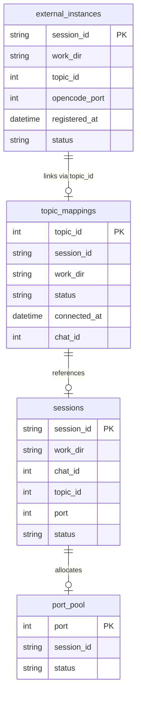

## Appendix: Database Schema

### Topic Store (topics.db)

```sql
-- Topic to Session mappings
CREATE TABLE topic_mappings (
  topic_id INTEGER PRIMARY KEY,
  session_id TEXT NOT NULL,
  work_dir TEXT,
  status TEXT DEFAULT 'active',
  connected_at TEXT DEFAULT CURRENT_TIMESTAMP,
  last_activity TEXT,
  streaming_enabled INTEGER DEFAULT 0,
  chat_id INTEGER NOT NULL
);

CREATE INDEX idx_topic_mappings_chat_id ON topic_mappings(chat_id);
CREATE INDEX idx_topic_mappings_status ON topic_mappings(status);
CREATE INDEX idx_topic_mappings_session_id ON topic_mappings(session_id);

-- External instances (from OpenCode plugin)
CREATE TABLE external_instances (
  session_id TEXT PRIMARY KEY,
  work_dir TEXT NOT NULL,
  topic_id INTEGER NOT NULL,
  opencode_port INTEGER NOT NULL,
  registered_at TEXT DEFAULT CURRENT_TIMESTAMP,
  last_heartbeat TEXT,
  status TEXT DEFAULT 'active'
);

CREATE INDEX idx_external_topic_id ON external_instances(topic_id);
CREATE INDEX idx_external_status ON external_instances(status);
```

### Orchestrator State (orchestrator.db)

```sql
-- Port allocation pool
CREATE TABLE port_pool (
  port INTEGER PRIMARY KEY,
  session_id TEXT,
  allocated_at TEXT,
  status TEXT DEFAULT 'available'
);

-- Session metadata
CREATE TABLE sessions (
  session_id TEXT PRIMARY KEY,
  work_dir TEXT NOT NULL,
  chat_id INTEGER NOT NULL,
  topic_id INTEGER,
  port INTEGER,
  status TEXT DEFAULT 'created',
  created_at TEXT DEFAULT CURRENT_TIMESTAMP,
  updated_at TEXT DEFAULT CURRENT_TIMESTAMP
);

CREATE INDEX idx_sessions_chat_id ON sessions(chat_id);
CREATE INDEX idx_sessions_status ON sessions(status);
```

### Entity Relationships



### Query Examples

```typescript
// Find active session by topicId
const stmt = db.prepare(`
  SELECT tm.*, s.port, s.status as session_status
  FROM topic_mappings tm
  LEFT JOIN sessions s ON tm.session_id = s.session_id
  WHERE tm.topic_id = ? AND tm.status = 'active'
`);

// Get all active sessions for a chat
const stmt = db.prepare(`
  SELECT tm.*, s.*
  FROM topic_mappings tm
  JOIN sessions s ON tm.session_id = s.session_id
  WHERE tm.chat_id = ? AND tm.status = 'active'
  ORDER BY tm.connected_at DESC
`);

// Allocate port from pool
const stmt = db.prepare(`
  SELECT port FROM port_pool
  WHERE status = 'available'
  ORDER BY port
  LIMIT 1
`);
```